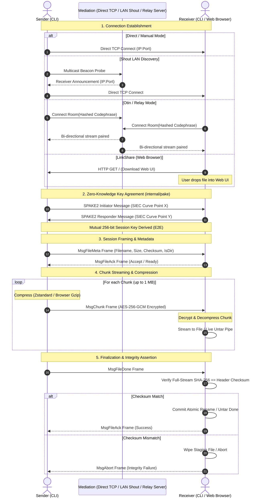

# mittodrop System Architecture

Welcome to the internal system architecture documentation for `mittodrop`. This document describes the runtime components, data flows, connection orchestration, transfer methods, and streaming pipelines.

> **Navigation:**
> - [Contributing Guide](../CONTRIBUTING.md)
> - [Cryptographic & Wire Protocol Specification](./SPECIFICATION.md)
> - [Security Policy](../SECURITY.md)

---

## 1. High-Level Subsystem Architecture

`mittodrop` provides zero-knowledge, end-to-end encrypted file and directory transfers across local networks, direct peer-to-peer WAN connections, web browsers, and NAT-traversing relays.

```
+---------------------------------------------------------------------------------------------------+
|                                            CLI Layer                                              |
|                               (cmd/mittodrop -> cmd/app -> cliparser)                             |
+---------------------------------------------------------------------------------------------------+
                                                  |
         +--------------------+-------------------+--------------------+--------------------+
         |                    |                   |                    |                    |
         v                    v                   v                    v                    v
+------------------+ +-----------------+ +-----------------+ +-----------------+ +------------------+
|      Shout       | |    LinkShare    | | Manual (Direct) | |      Otin       | |   Relay Serve    |
| (LAN mDNS / Bcast| | (HTTP + Browser | | (Direct TCP P2P | | (NAT Traversal  | | (Self-Hosted     |
|   Signaling)     | | Web Crypto UI)  | |  + Port Hunting)| | Relay / Tunnel) | | Rendezvous Server|
+------------------+ +-----------------+ +-----------------+ +-----------------+ +------------------+
         |                    |                   |                    |                    |
         +--------------------+-------------------+--------------------+                    |
                              |                                                             |
                              v                                                             |
+-------------------------------------------------------------+                             |
|                    PAKE Handshake Engine                    |                             |
|          (internal/pake: SPAKE2 over SIEC Elliptic Curve)   |                             |
+-------------------------------------------------------------+                             |
                              |                                                             |
                              v [Mutual 256-bit Session Key]                                |
+-------------------------------------------------------------+                             |
|                   Transport Framing Layer                   |                             |
|    (internal/transport: AES-256-GCM Authenticated Frames)   |                             |
+-------------------------------------------------------------+                             |
                              |                                                             |
              +---------------+---------------+                                             |
              |                               |                                             |
              v                               v                                             v
+-----------------------------+ +-----------------------------+             +-------------------------------+
|       Sender Pipeline       | |      Receiver Pipeline      |             |         Relay Server          |
| (transfer.Reader/DirReader) | |      (transfer.Writer)      |             |       (internal/relay)        |
|  - On-the-fly streaming TAR | |  - On-the-fly streaming untar|            |  - Blind bidirectional pipe   |
|  - Adaptive Zstd/Gzip comp  | |  - Zip-Slip path jail check |             |  - In-memory ephemeral rooms  |
|  - 64 KB/1 MB chunk rings   | |  - Atomic rename & staging  |             |  - Rate limiting & room TTL   |
|  - Full-stream SHA-256 sum  | |  - Full-stream SHA-256 check|             |  - Zero plaintext exposure    |
+-----------------------------+ +-----------------------------+             +-------------------------------+
```

---

## 2. All Transfer Methods Explained

### 2.1 Shout (`shout send` / `shout rec`)
- **Use Case**: Frictionless file transfers across devices on the **same local area network (LAN)**.
- **Discovery**: Uses broadcast/multicast beacons and local signaling to pair sender and receiver without requiring manual IP address entry.
- **Security**: Once discovered, peers execute a zero-knowledge PAKE handshake and stream via authenticated AEAD frames.

### 2.2 LinkShare (`linkshare serve` / `linkshare send`)
- **Use Case**: Frictionless cross-device transfers between a terminal and **any web browser** (desktop, iPhone, Android) on the LAN.
- **Embedded Web UI**: Serves a modern responsive web interface (`internal/sharepage`) directly from memory with in-page access token authorization, theme switching, and real-time upload progress.
- **Client-Side Web Crypto**: Mobile and desktop browsers compute SHA-256 hashes using the browser's native Web Crypto API (`crypto.subtle.digest`) before uploading.
- **In-Browser Compression**: Uses native `CompressionStream('gzip')` in JavaScript to compress compressible payloads before transmitting over HTTP/WebSocket.
- **CLI Receiver & Sender**: Automatically receives files with token authentication; CLI sender prompts interactively for access tokens when connecting to token-protected receivers.

### 2.3 Manual / Direct P2P (`direct send` / `direct rec`)
- **Use Case**: High-speed point-to-point transfers over direct IP connections without third-party servers.
- **Port-Hunting Fallback**:
  - Receiver checks preferred port (`42201`).
  - If occupied, it automatically probes sequential candidate ports (`42201–42205`).
  - If all candidate ports are in use, it gracefully falls back to OS ephemeral port `:0`.
- **UPnP Port Mapping**: Attempts automated IGD port forwarding via `internal/portmap` for traversal across home routers.
- **Connection**: Sender dials the receiver's reported IP and bound port directly.

### 2.4 Otin (`otin send` / `otin rec`)
- **Use Case**: Transfers across restrictive firewalls, symmetric NATs, cellular data, or isolated networks where direct TCP dials fail.
- **Rendezvous Tunnel**: Peers connect to a shared rendezvous room on an external relay server or encrypted tunnel.
- **End-to-End Guarantees**: Even though traffic traverses an intermediary relay, payload data is encrypted strictly between sender and receiver using ephemeral PAKE-negotiated keys.

### 2.5 Relay Server (`relay serve`)
- **Use Case**: Self-hosted rendezvous infrastructure for organizations or privacy-conscious users (`mittodrop relay serve -p 42201`).
- **Blind Stream Piping**: The relay server matches peers by hashed room identifiers and blindly pumps encrypted binary frames between them.
- **Hardened Limits**: Features configurable room TTLs (e.g. 30m), maximum concurrent room caps, connection rate-limiting, and optional password authorization (`--relay-pass`).

---

## 3. End-to-End Transfer Flow Diagram



---

## 4. On-the-Fly Recursive Directory Streaming

`mittodrop` streams folders dynamically without creating temporary `.tar` or `.zip` archive files on disk:

```
Sender Host:
[ Local Directory ] 
       | (Recursive tree walk)
       v
[ archive/tar.Writer ] ---> [ io.PipeWriter ]
                                   |
                             [ io.PipeReader ] ---> [ transfer.Reader ]
                                                          | (Chunk & compress)
                                                          v
                                                    [ transport.Framer (AES-GCM) ]
                                                          |
====================================================== [ Network ] ==================
                                                          |
Receiver Host:                                            v
                                                    [ transport.Framer (Decrypt) ]
                                                          |
[ Local Target Dir ] <--- [ archive/tar.Reader ] <--- [ io.PipeReader ]
```

### Execution Steps:
1. **Dry-Run Sizing Pass**: Walks the directory tree, writing entries into a discard hasher to compute the exact uncompressed TAR byte length and full-stream SHA-256 hash.
2. **Live Streaming Pass**: Goroutine streams the live TAR archive into an `io.Pipe()`. Chunker slices data into bounded chunks, compresses them with Zstandard, encrypts them with AES-GCM, and dispatches frames.
3. **Receiver Live Untar & Jail Confinement**: Chunks are decrypted and pumped into an `io.PipeWriter`. An extractor goroutine unpacks directories (`os.MkdirAll`) and files (`io.Copy`) live.
4. **Zip-Slip Defense**: Path traversal sanitization strictly ensures target paths cannot climb out of destination folders.

---

**Next:** Review the [Cryptographic & Wire Protocol Specification](./SPECIFICATION.md).
